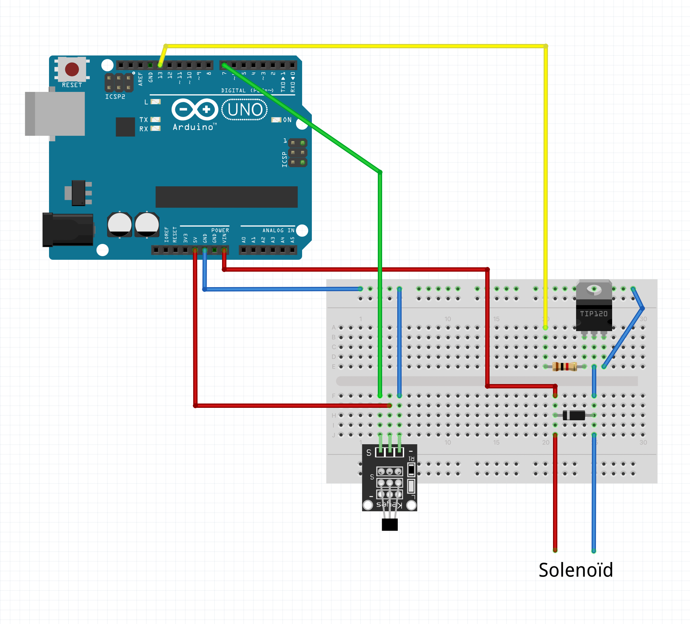

# Een geheim slot voor een bureauschuif

Deze code komt bij het hoofdstuk in het vierde doeboek voor kleine nerds van nerdland.

## Componenten

* Arduino Uno
* 12v adaptor
* 12v Solenoïd
* Hall-effect sensor op breakout board
* Transistor: tip120
* 1K weerstand
* Diode
* Breadboard
* 10 male-male jumper kabels
* 3 male-female jumper kabels
* Magneet

## Elektronische schakeling

## 3D-files

* [3D-geprint hoekje](3D-files/hoekblokje-kleinevijsgaten.stl)
* [3D-geprinte ring voor de magneet](3D-files/magneetring-16mm.stl)

Alle verdere uitleg staat in het boek. Veel succes!
